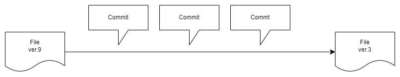
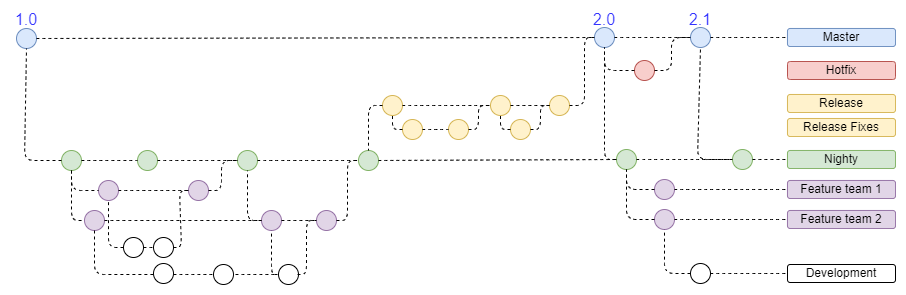
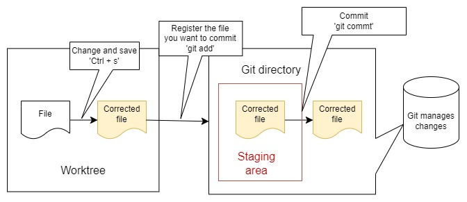
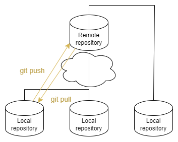

# ソフトウェア工学 2024

Summarize what I've learned in software engineering on this page.

## About software and software engineering

### Software definition
- A set of insruction words that, when executed, provide the required characteristics, functions, and performance.
- Data structures that allow programs to handle information appropriately.
- Information describing the operation and use of the program
### Software features
- Must adanpt to meet the needs of new environments and technologies.
- Must be enhanced to meet new business demand
- Must be extended to interoperate with more modern systems and databases.
***
### Definition of Software Engineering
&nbsp; "The application of a sustematic, disciplined, and quantifiable approach to software development, operation, and maintenance, that is the application of engineering to software."
***

***
## About git
***

&nbsp; git is a distributed version control system, originally software for open source software management.  
&nbsp; git has the following advantages:
- A history of changes is kept
- Can go back to the point where you made the change
- Can be edited jointly with others

### Repository
&nbsp; git has local and remote repositories in the project folder managed by git

<dl>
    <dt><strong>Local repository</strong></dt>
        <dd>&nbsp; Execution environment for individual projects.</dd>
        <dd>&nbsp; Local repository is a copy of the entire project's and codebase that resides on a developer's machine.</dd>
        <dd>&nbsp; It allows developers to work offline.</dd>
</dl>

<dl>
    <dt><strong>Remote repository</strong></dt>
        <dd>&nbsp; Shared management location</dd>
        <dd>&nbsp; Remote repository serv es as a central hub where developers can collaborate and share their work with others.</dd>
        <dd>&nbsp; It enables team members to synchronize their changes and provides backup and visibility for the project.</dd>
</dl>

### Commit

&nbsp; Use "Commit" to record file creation/modification/deletion.  
&nbsp; Commit has the folloeing characteristics:  

- When manipulating a file, it must be known "when","who","what", and "how" the file was manipulated, and when committing the file, "how" the file was manipulated should be described.
- There can be one or more target files to commit
- The user is free to determine the unit of commit

### Branch

&nbsp; "Branch" alows work to be branched out. This allows for collaboration and transition work

### Flow in local repository

#### Worktree  
- There are three states of files  
 1.untracked  
  &emsp; The state of files not tracked by git  
 2.unmodified  
  &emsp; The state of files tracked by git but not corrected  
 3.modifieed  
  &emsp; The state of files tracked and corrected by git

#### Staging area
- Register files tracted by git  
- staged: The state of files registered in staging area  

#### Git directory
- Register changes by "commit"  
- <strong>In principle, "commit" can't be changed or deleted</strong>  
&emsp; &nbsp; (Changes and deletion of "commit" are also recorded)  
- Committed files become unmodified  

### Flow in remote repository
- Reflect changes committed in local repository to remote repository ("git push")  
- Reflect content from remote repository to local repository ("git pull")  

## Git Commands

The main commands used in git are following:

<strong>Setting/confirmation system</strong> 

<dl>
    <dt><strong>git init</strong></dt>
        <dd>Initialize/set up git</dd>
    <dt><strong>git status</strong></dt>
        <dd>Display work tree status</dd>
    <dt><strong>git config</strong></dt>
        <dd>Check/change around settings</dd>
    <dt><strong>git log</strong></dt>
        <dd>Show log</dd>
        <dd>'--oneline' listing of only one line of a commit message</dd>
    <dt><strong>git diff</strong></dt>
        <dd>Show file diffs</dd>
</dl>

<strong>Commit system</strong> 

<dl>
    <dt><strong>git add</strong></dt>
        <dd>Add to staging area</dd>
    <dt><strong>git commit</strong></dt>
        <dd>Commit execution</dd>
</dl>

<strong>Correction system</strong> 

<dl>
    <dt><strong>git commit --amend --no-edit</strong></dt>
        <dd>Commit correction</dd>
    <dt><strong>git checkout</strong></dt>
        <dd>Recover deleted files, restore past commits, etc.(if undo changes are in staging area/index)</dd>
    <dt><strong>git reset</strong></dt>
        <dd>Reset commit</dd>
    <dt><strong>git revert</strong></dt>
        <dd>Commit to "cancel commit changes"</dd>
    <dt><strong>git rm</strong></dt>
        <dd>Delete files and index information</dd>
</dl>

<strong>Remote system</strong> 

<dl>
    <dt><strong>git clone</strong></dt>
        <dd>Copy repository</dd>
    <dt><strong>git pull</strong></dt>
        <dd>Synchronization of remote repositories</dd>
    <dt><strong>git push</strong></dt>
        <dd>Upload changes</dd>
    <dt><strong>git request-pull</strong></dt>
        <dd>Pull request : Change request</dd>
    <dt><strong>git remote</strong></dt>
        <dd>Remote repository setting</dd>
</dl>

<strong>Branch system</strong> 

<dl>
    <dt><strong>git branch</strong></dt>
        <dd>Branch creation</dd>
    <dt><strong>git checkout</strong></dt>
        <dd>Branch switching</dd>
    <dt><strong>git merge</strong></dt>
        <dd>Branch consolidation</dd>
        <dd>'--ff-only:fast forward only' marge into unchanged destination branch</dd>
    <dt><strong>git clone</strong></dt>
        <dd>Copy repository</dd>
    <dt><strong>git push</strong></dt>
        <dd>Upload changes</dd>
</dl>

